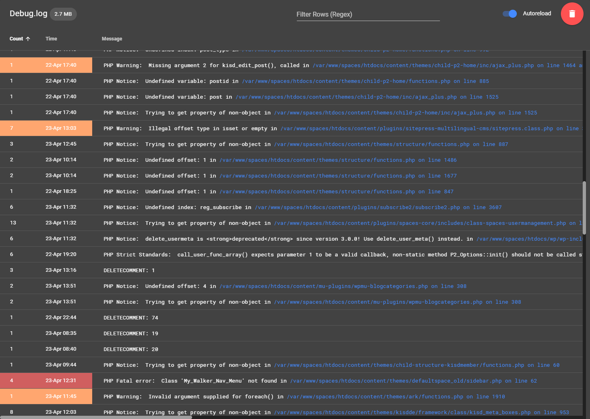

# PHP Error Log Viewer

A single-file GUI for your php log files which groups similar errors. Written in PHP and Vue.js.

 - Reads the specified log file and automatically shows you new errors when they appear.
 - Groups errors with similar text
 - Can be configured so clicking on an error will directly bring you to vscode.

## Disclamer
 - This contains code for deleting your log-file.
 - Might be heavy for you server for large log files.
 - It is meant for development-environments.


## Getting Started

Just copy the file next to your debug.log.

or
```bash
composer require-dev schuhwerk/php-error-log-viewer
```

## Usage

Open the file in your browser (like http://mydomain.local/php-error-log-viewer.php)



## Settings

You can specify settings in a file named 'php-error-log-viewer.ini' in the same folder (or for composer in the grandparent folder).

```ini
;path the the log file. relative to the viewer file.
file_path='../../app/debug.log'
;toggle the linking feature
vscode_links=true
;when you run a virtual machine for development your server path might diverge from your loacal path. this is server.
vscode_path_search='/srv/www/current/'
;
vscode_path_replace='C:/my-repository/'
```
